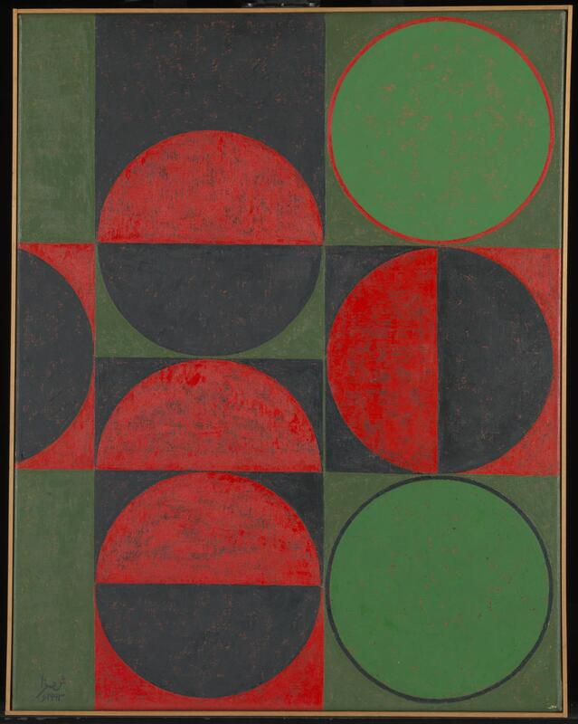
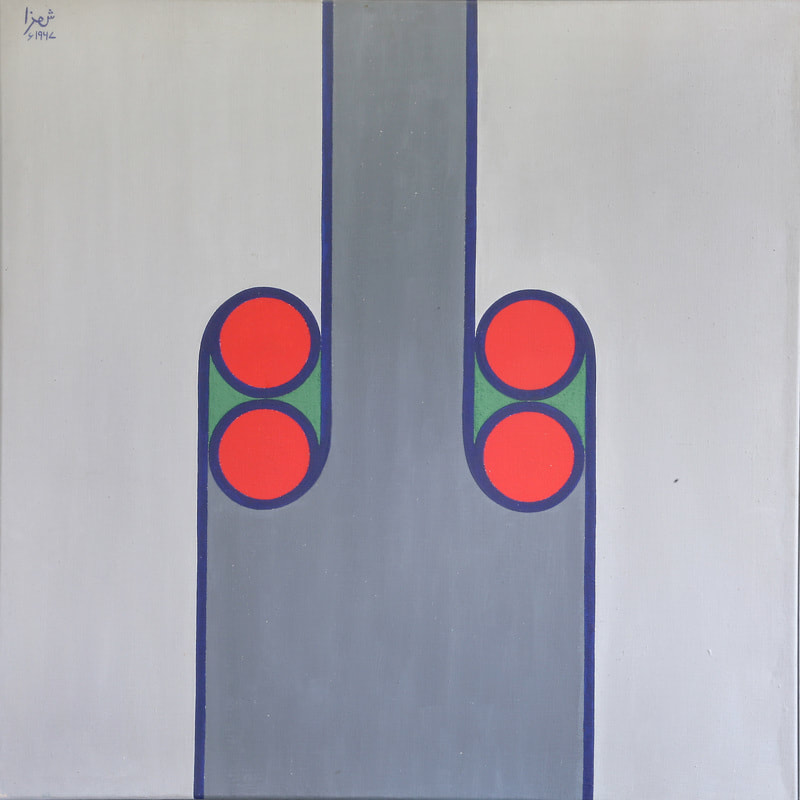
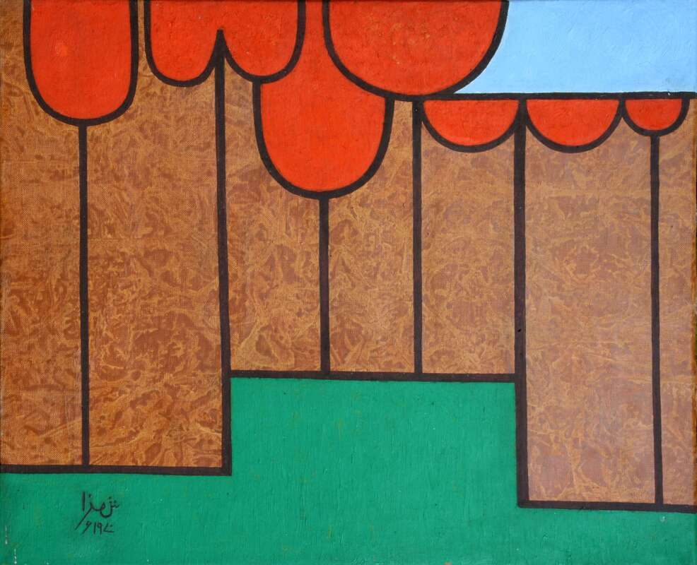
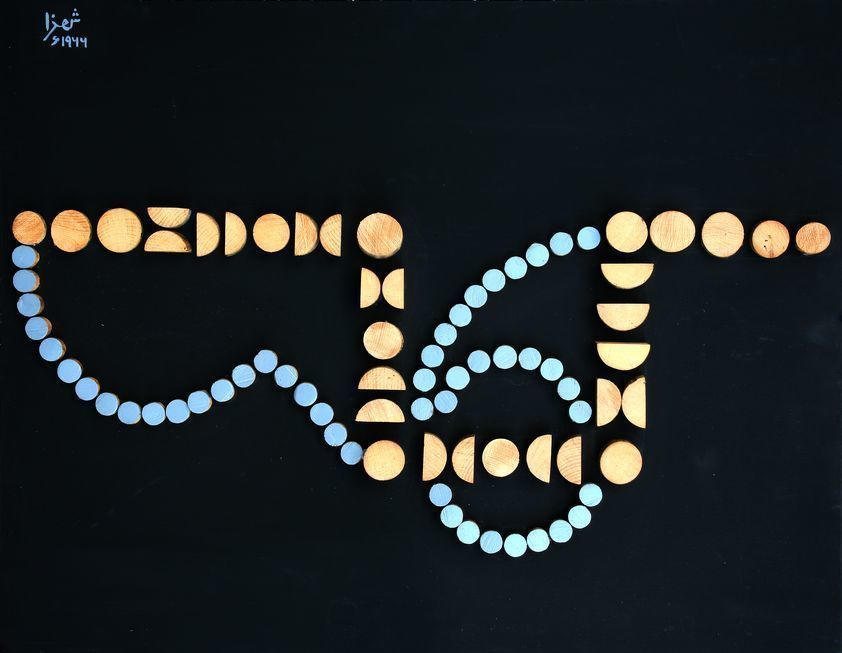

# IDEA9103-Tut-1--Russian--Group-E

## Section 1: Research and Inspiration
The artwork that we chose is Apple Tree by Anwar Jalal Shemza.
Apple Tree was created in 1962, which is a part of exploration of organic forms. In Apple Tree, Anwar uses repeated circular and linear patterns to represent the structure of tree, which created a sense of balance and rhythm.

This artwork is shown below:

The same characteristics also shown in other artworks by Anwar such as: 

##### Composition in Red and Green, 1963.

##### Meem Two 1967.

##### Apple Trees, 1970.

##### Composition with a Number Six, 1966

The reason that Apple Tree has been chosen is because it can be created in the same method with JavaScript and specifically p5.js, which leads itself to use simple geometric shapes to create natural artworks similar to what Anwar has created. This has inspired the group to follow a similar trend by using simple geometric shapes and lines to create nature based artworks in code. Also, this concept helps the group understand how to use JavaScript to generate the structural layout of branches and leaves obersved in Anwar's work. Similarly, we will use the concept of generative art to repeat the lines of branches and leaves to build the complexity of the work.
Moreover, the nature elements such as trees has a potential of growth, allowing the opportunity to create the iteration of the form of our individual works.

## Section 2: Technical Planning
In the coding part, the group plans to create a drawing class which contain the single element in structure of 'Apple Tree' that created by draw function such as: drawCircles() or drawLines(). These circles will be separated in several classes which includes Circle in trunk structure, Circle in branch structure and Circle and rectangle in bottom structure. Then use for loop to repeat the simple patterns in different classes to organize the main structure of artwork. Finally use the coding in the Week 9 lecture and tutorial such as easing and translate to creating animate for our work. The animate could be a grow process of the Apple Tree, which can be created by using translate and scale functions. The animate can also be the process of apple fall from the tree, which use rotate and translate functions.

[Link to Precedents1](https://openprocessing.org/sketch/2225948)

[Link to Precedents2](https://openprocessing.org/sketch/138954)

[Link to Image and artworks information](https://www.anwarshemza.com/publiccollections1.html)

## Section 3: Implementation
"Show iterations of your process to achieve the outcome. This should include some screen shots of outputs of different stages of your work. If your group’s design wasn't fully realised in code, still showcase your intentions as well as the results you were able to achieve and iterations to get there. Highlight how you were or weren’t able to able to stick to your planning in section 1."

## Section 4: Technical Overview
"Create a comprehensive overview of how your final group code works. This should contain code snippets (screenshots of code or text), along with explanations of each. You can also create an overall flowchart or visual map showing the major sections of your code and how they relate to each other."